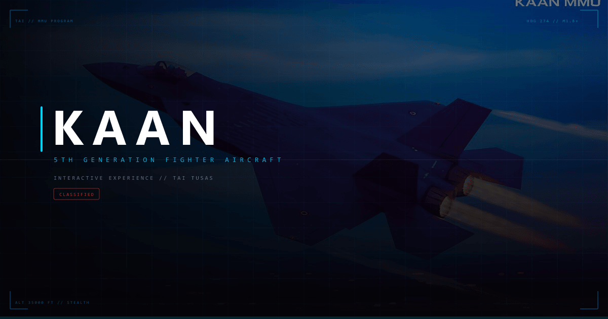

# KAAN - 5. Nesil Savaş Uçağı İnteraktif Web Deneyimi

<p align="center">
  
</p>

> **⚠️ YASAL UYARI (LEGAL DISCLAIMER)**
> Bu proje, **Mehmet Gümüş (SpaceEngineerSS)** tarafından geliştirilmiş kâr amacı gütmeyen bir **FAN-MADE (Hayran Yapımı)** çalışmasıdır.
>
> 1. Bu web sitesi **TUSAŞ (Türk Havacılık ve Uzay Sanayii)** ile resmi bir bağa sahip değildir.
> 2. "KAAN" ismi, tasarımları ve ilgili tüm materyaller TUSAŞ'ın tescilli markasıdır.
> 3. Bu proje yalnızca WebGL, Next.js ve 3D animasyon yeteneklerini sergilemek amacıyla üretilmiş bir "Konsept Portfolyo" çalışmasıdır.
> 4. İçerikte yer alan görseller ve videolar, kamuya açık kaynaklardan eğitim amaçlı derlenmiştir.
> 5. Projenin herhangi bir ticari amacı **yoktur**. Reklam gelirleri, sponsorluklar veya bağışlar kabul edilmemektedir.

---

## 🛠 Proje Hakkında

Bu çalışma, Türkiye'nin 5. nesil milli muharip uçağı KAAN'ın modern web teknolojileri ile nasıl sunulabileceğine dair bir vizyon projesidir. Gerçek zamanlı 3D render, kokpit simülasyonu, HUD overlay ve interaktif galeri gibi ileri düzey özellikler içerir.

### 🔴 Kurallar (Fair Use Kapsamı)

Bu proje, aşağıdaki ilkelere uygun olarak **Fair Use (Adil Kullanım)** kapsamında hazırlanmıştır:

| İlke | Uygulama |
|------|----------|
| **Amaç** | Eğitim ve portfolyo, ticari değil |
| **Nitelik** | Orijinal kod + kamusal görseller |
| **Oran** | Tüm kod %100 orijinal, görseller kamuya açık kaynaklardan |
| **Etki** | TUSAŞ'ın ticari faaliyetlerine zarar vermez |

### Yasal Koruma Katmanları

Site üzerinde **3 katmanlı yasal koruma** bulunmaktadır:

1. **Giriş Ekranı Uyarısı** — Site açılışında "RESMI SITE DEĞILDIR" bildirimi
2. **Navbar Rozeti** — Her sayfada "KONSEPT" / "FAN PROJECT" etiketi
3. **Footer Bildirimi** — TUSAŞ marka hakları bildirimi

---

## 🚀 Teknoloji Yığını

| Teknoloji | Kullanım |
|-----------|----------|
| **Next.js 15** | App Router, SSR, optimize edilmiş build |
| **React Three Fiber** | 3D sahne, GLTF model render |
| **GSAP** | Scroll animasyonları, geçişler |
| **Tailwind CSS v4** | Utility-first stil sistemi |
| **TypeScript** | Tip güvenli geliştirme |
| **Web Audio API** | Ambient jet motoru sesi, SFX |
| **Canvas API** | Kokpit MFD panelleri |

### Öne Çıkan Özellikler

- 🎯 **3D KAAN Modeli** — Mouse parallax ile etkileşimli döndürme
- 🖥️ **Panoramik Kokpit Ekranı** — 4 panelli MFD (Taktik Harita, Durum, HSI, Silah Sistemi)
- 🗺️ **Türkiye Haritası** — Taktik haritada gerçek kıyı hatları
- 🎯 **HUD Overlay** — Mouse takipli nişangah sistemi
- 🌙 **Gece/Gündüz Modu** — Tam tema desteği
- 🔊 **Ses Motoru** — Ambient jet motoru hum + tıklama SFX
- 🌍 **TR/EN Dil Desteği** — Anlık geçiş
- ⌨️ **Klavye Kısayolları** — N (gece modu), M (sessiz), L (dil)
- 📱 **PWA Desteği** — Standalone uygulama modu
- ♿ **Erişilebilirlik** — Skip-to-content, focus-visible, ARIA etiketleri
- 📊 **Karşılaştırma Tablosu** — 5. nesil savaş uçakları teknik karşılaştırma
- 🔥 **Özel 404 Sayfası** — Askeri HUD temalı "Radar Teması Kaybedildi" ekranı

---

## � Ekran Görüntüleri

> Canlı demo için: [Deployment URL]

---

## 🏗 Kurulum

```bash
# Repoyu klonlayın
git clone https://github.com/SpaceEngineerSS/kaan-3d-web-experience.git
cd kaan-3d-web-experience

# Bağımlılıkları yükleyin
npm install

# Geliştirme sunucusunu başlatın
npm run dev

# Production build
npm run build
```

[http://localhost:3000](http://localhost:3000) adresini tarayıcınızda açın.

---

## 📁 Proje Yapısı

```
kaan-3d-web-experience/
├── public/
│   ├── gallery/          # Galeri görselleri
│   ├── og-image.png      # Open Graph sosyal medya resmi
│   ├── manifest.json     # PWA manifest
│   └── cursor.png        # Özel imleç
├── src/
│   ├── app/
│   │   ├── layout.tsx    # Root layout (meta, fontlar, SEO)
│   │   ├── page.tsx      # Ana sayfa (tüm seksiyonlar)
│   │   ├── not-found.tsx # Özel 404 sayfası
│   │   └── globals.css   # Global stiller, animasyonlar
│   ├── components/
│   │   ├── HeroScene.tsx         # 3D sahne (R3F Canvas)
│   │   ├── KaanModel.tsx         # GLTF model yükleyici
│   │   ├── ScrollSections.tsx    # GSAP scroll animasyonları
│   │   ├── SpecsGrid.tsx         # Teknik özellikler grid
│   │   ├── TechnologyDetails.tsx # Teknoloji kartları
│   │   ├── ComparisonChart.tsx   # 5. nesil karşılaştırma
│   │   ├── Timeline.tsx          # Program milestones
│   │   ├── TechnicalArchive.tsx  # Fotoğraf galerisi + Lightbox
│   │   ├── LegalDisclaimer.tsx   # Yasal uyarı popup
│   │   ├── HUDOverlay.tsx        # HUD nişangah overlay
│   │   ├── Navbar.tsx            # Navigasyon + KONSEPT rozeti
│   │   ├── Footer.tsx            # Footer + yasal bildirim
│   │   └── ui/
│   │       ├── CockpitDashboard.tsx  # 4-panel MFD kokpit
│   │       └── SoundEngine.tsx       # Web Audio SFX
│   ├── hooks/
│   │   ├── useMouseParallax.ts       # Mouse parallax hook
│   │   └── useKeyboardShortcuts.ts   # Klavye kısayolları
│   ├── context/
│   │   ├── LanguageContext.tsx    # TR/EN dil sağlayıcı
│   │   └── ThemeContext.tsx      # Gece/gündüz tema
│   └── lib/
│       └── translations.ts      # Tüm çeviriler + yasal metinler
├── LICENSE                       # MIT (kod) + Asset feragatnamesi
├── CONTRIBUTING.md               # Katkı rehberi
├── SECURITY.md                   # Güvenlik politikası
└── README.md                     # Bu dosya
```

---

## ⌨️ Klavye Kısayolları

| Kısayol | İşlev |
|---------|-------|
| `N` | Gece/Gündüz modu geçişi |
| `M` | Ses açma/kapatma |
| `L` | TR/EN dil değiştirme |
| `Esc` | Lightbox / genişletilmiş paneli kapat |
| `←` `→` | Lightbox'ta önceki/sonraki görsel |

---

## 🔧 Komutlar

```bash
npm run dev      # Geliştirme sunucusu (localhost:3000)
npm run build    # Production build
npm run lint     # ESLint kontrolü
npx tsc --noEmit # TypeScript tip kontrolü
```

---

## 📜 Lisans

Kaynak kodu **MIT Lisansı** altında sunulmaktadır. Ancak görsel varlıklar, 3D modeller ve "KAAN" markası TUSAŞ/TAI'nin mülkiyetindedir ve yalnızca konsept gösterim amacıyla kullanılmıştır. Detaylar için [`LICENSE`](./LICENSE) dosyasına bakınız.

**Non-commercial use only.** Ticari kullanım için TUSAŞ'tan ayrı izin alınması gerekmektedir.

---

## 🤝 Katkıda Bulunma

Katkı rehberi için [`CONTRIBUTING.md`](./CONTRIBUTING.md) dosyasına bakınız.

---

<p align="center">
  <strong>Mehmet Gümüş</strong> tarafından geliştirildi<br>
  <a href="https://github.com/SpaceEngineerSS">github.com/SpaceEngineerSS</a>
</p>
